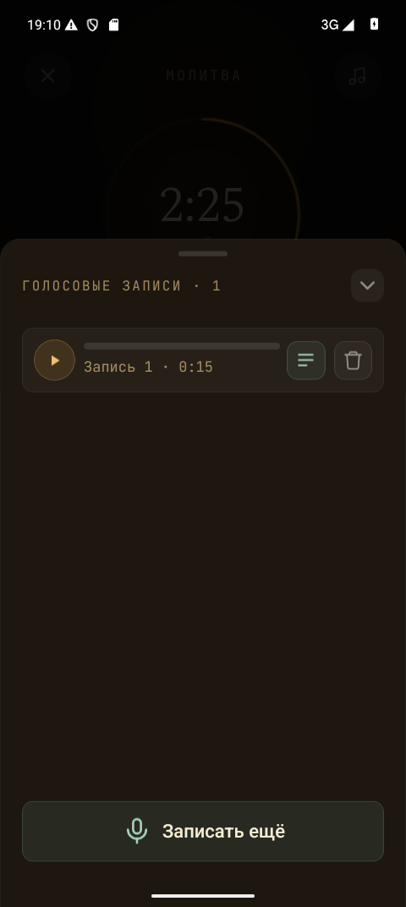

# Android voice recordings keyboard — 2026-10-07

Work for [Android ANS-024 keyboard fix](https://app.clickup.com/t/123pfqn27w9).
The already known ANS-024 scenario was tracked in
[the keyboard-flow task](https://app.clickup.com/t/86cbj8b62) and previously passed
on iPhone. The Android observation does not prove an identical historical root
cause.

## Change and build

The answer input releases focus when voice recordings open and is not editable
while covered by the recordings sheet. Closing recordings restores editing
without clearing the draft. The Android regression flow checks native keyboard
visibility, recording actions, retained text and renewed editing.

Before: `main` commit `710a97206409c1bc0b7908cffffbe4fcdabf76dd`, Release 1.3.5.
After: app-code commit `ce58ebaab5777cabfa4b109c29869ed426c46fd6`, standalone
Release 1.3.6 built for x86_64 with Expo SDK 57 / React Native 0.86.3. APK SHA-256:
`81c5b5ccda7ea5a7de2a9d3b443708057598044db00b9231424fa1064ca1b760`.
Both observations used the existing Pixel_9_Pro_API_35, Emulator 37.2.12,
Russian Gboard, and the real test API. The 480×1071 / density-180 override keeps
the original logical viewport and is reset after testing. Native manifest
metadata and bundled test origin/key were checked without printing credentials.
The private APK is not published.

## Results as of 2026-10-07

| Check | Result | Evidence |
| --- | --- | --- |
| Original Android recordings regression on main | Exit 1; keyboard visibly remained open after opening existing recordings | [Full log](../evidence/2026-10-07-android-recordings-keyboard/before-master.log), [screenshot](../evidence/2026-10-07-android-recordings-keyboard/before-master.png) |
| `npm run typecheck` | Exit 0 | [Full log](../evidence/2026-10-07-android-recordings-keyboard/typecheck.log) |
| `npm test` | Exit 0, complete unit suite | [Full log](../evidence/2026-10-07-android-recordings-keyboard/unit.log) |
| Android Release build | Exit 0 | Full build output retained privately in the task scratch directory; APK identity above |
| First new Android ANS-024 invocation | Exit 1; keyboard dismissal, recording actions, original text retention and refocus passed; final text-edit assertion failed because of an incorrect test caret assumption | [Full log](../evidence/2026-10-07-android-recordings-keyboard/ans024-first.log), [finding](../evidence/2026-10-07-android-recordings-keyboard/attempt-one-finding.json) |
| Corrected Android ANS-024 invocation | Not run; owner's explicit retry permission pending | Corrected input is in `testing/android-e2e/android-ans-024-recordings-keyboard.yaml` |
| First 10-critical runner on Release 1.3.6 | Exit 1; first four entries passed, text-answer entry failed after its five-minute fixture expired; later entries not started by this runner | [Text-answer full log](../evidence/2026-10-07-android-recordings-keyboard/android-stage04-answers-text.log), [screenshot](../evidence/2026-10-07-android-recordings-keyboard/critical-answers-first.png), [timings](../evidence/2026-10-07-android-recordings-keyboard/critical-answer-timing.json) |
| Remaining five critical entries | All five exit 0; first invocations on this build, smoke followed immediately by relaunch | [Continuation output](../evidence/2026-10-07-android-recordings-keyboard/critical-continuation-runner.log), [per-entry results](../evidence/2026-10-07-android-recordings-keyboard/results.json) |
| Corrected critical text-answer entry | Not run; owner's explicit retry permission pending | Its unrelated fixture now uses an untimed prayer; saved-answer assertions are unchanged |

## Native result and test correction

The first fixed-build invocation verified that Gboard disappeared, the existing
recording and bottom action were visible, the exact original answer text was
retained, and focusing it again showed the keyboard. The screenshot confirms
the full recordings action is available:



The last assertion failed because `eraseText` removes characters to the left of
the caret; tapping the input had put the caret before the final `ys`. The actual
text became `Keyboard editing restoredys`, proving editing worked but the
test's whole-field-clear assumption was wrong. The full nonzero output,
hierarchy and [failure screenshot](../evidence/2026-10-07-android-recordings-keyboard/post-edit-first-failure.png)
were inspected. This original nonzero result is preserved and is not counted as
a fully passed ANS-024 flow.

The corrected final check inserts one marker at the actual caret, copies the
field and requires that removing that marker recovers the exact original text.
Keyboard visibility and retention assertions remain mandatory. This correction
has not been run; no app code or APK changed after the build.

## Critical text-answer failure

The critical text-answer input selected a five-minute prayer. The full trace
places the expected post-save dock assertion 305,915 ms after the entry swipe
started; entering the answer field took 77,339 ms, typing 51,160 ms, and Save
53,770 ms. The failure screenshot shows reflection; there is no preceding
Finish command or native app crash. This result is preserved as nonzero.

The text-persistence fixture is changed to untimed; deadline behavior already
passed independently in SES-001 on this same build. No saved-answer assertion
is removed. The proposed corrected invocation requires explicit owner approval
and has not run. The five later independent critical entries each passed their first invocation,
retaining the smoke/relaunch dependency. Combined results are **9 exit 0 and 1
nonzero**, not a fully passed critical gate. No test was retried. The emulator
was shut down and its display overrides reset after both blocks.

## Selected critical evidence

The [first runner output](../evidence/2026-10-07-android-recordings-keyboard/critical-first-runner.log)
and [continuation output](../evidence/2026-10-07-android-recordings-keyboard/critical-continuation-runner.log)
retain the entry order and stopping boundary. `results.json` records exact exit
codes, the app-code commit and check results. Full per-entry logs in
`../evidence/2026-10-07-android-recordings-keyboard/android-*.log` cover each of
these ten entries:

- `android-stage06-jrn-001-empty-history`
- `android-stage03-setup-start`
- `android-stage03-navigation`
- `android-stage03-session-finite`
- `android-stage04-answers-text`
- `android-stage06-end-001-finish-without-takeaway`
- `android-stage06-end-002-finish-with-takeaway`
- `android-privacy-consent-first-use`
- `android-smoke-full`
- `android-smoke-full-relaunch`

## Verification commands and scope

The targeted command is:

```bash
maestro --device emulator-5554 test --test-output-dir "$run_dir/ans024" testing/android-e2e/android-ans-024-recordings-keyboard.yaml
```

The separate first critical run on the new build uses:

```bash
ANDROID_TEST_OUTPUT_DIR="$run_dir/critical" npm run test:e2e:android:critical
```

Full native outputs and exit files are retained in the ignored task directory
`.expo/test-runs/2026-10-07-ans024-fix/`; only the decisive evidence listed above
is selected for the repository. The unrelated content-report keyboard defect,
the larger remaining release suite, iOS, and physical-device checks are outside
this fix verification. This is not release acceptance.
